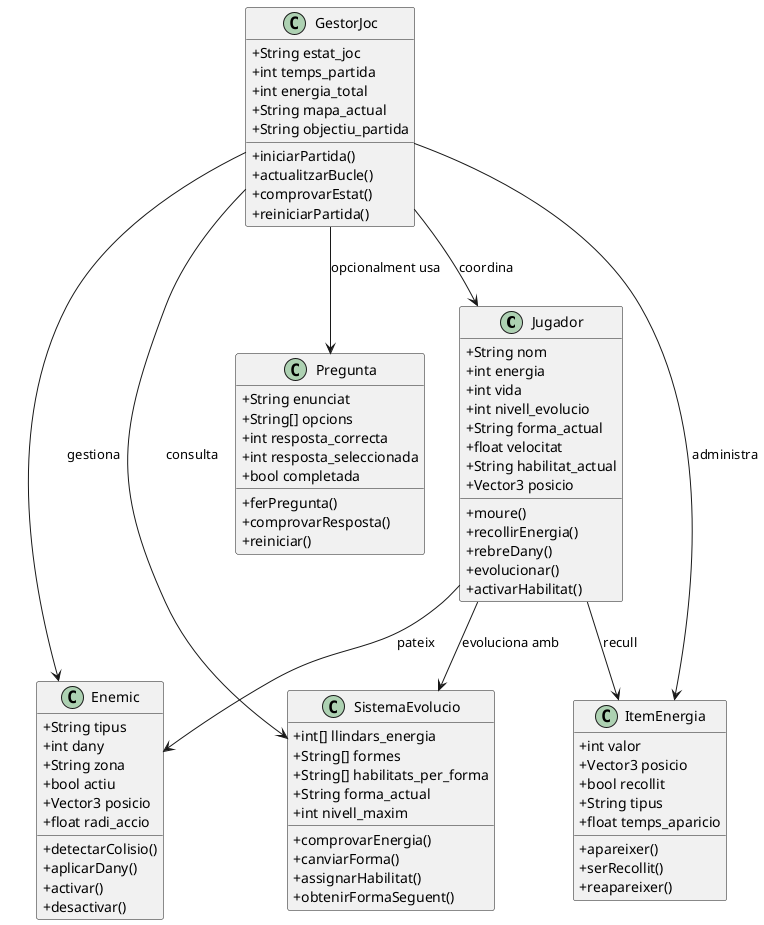
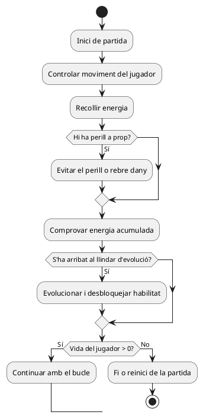

# Diagrames UML per a *Evolució Absurda*

Aquest document recull els dos codis PlantUML necessaris per generar els diagrames del projecte. El primer correspon al diagrama de classes i el segon al diagrama de comportament. Tots dos estan pensats per ser coherents amb la idea del joc definida a `01_idea_i_abast.md`.

## Diagrama de classes

Aquest diagrama mostra les entitats principals del joc, els seus atributs, els seus mètodes i les relacions bàsiques entre elles. Serveix com a base per organitzar el codi futur de manera clara i modular.

## Diagrama de comportament

Aquest diagrama representa el bucle principal del joc i explica què passa mentre la partida està en marxa. Mostra el flux de moviment, recollida, perill, evolució i repetició.

## Notes d’ús

Per generar les imatges, copia cadascun dels blocs en un fitxer `.puml` diferent o enganxa’ls directament a un editor compatible amb PlantUML. Després només cal exportar-los a PNG amb els noms `diagrama_classes.png` i `diagrama_comportament.png` per complir els entregables del projecte.
